# 2.리눅스(OEL8.4) 설치(2024.04.02)

**2.1 설치파일 다운로드**

Oracle Software Delivery Cloud에서 OEL로 검색해서 다운로드 한다.

https://edelivery.oracle.com/osdc/faces/SoftwareDelivery

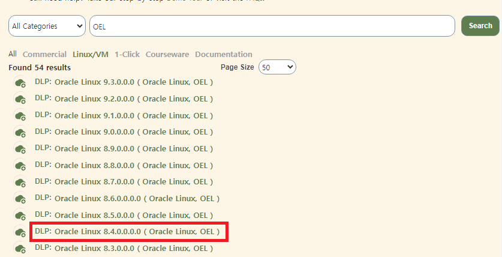

OEL를 선택하고 8.4버전을 누른다.

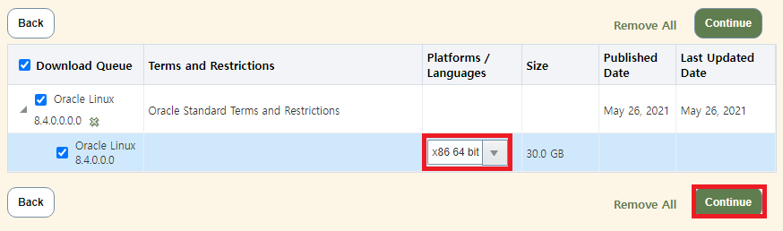

64비트에 체크한다.

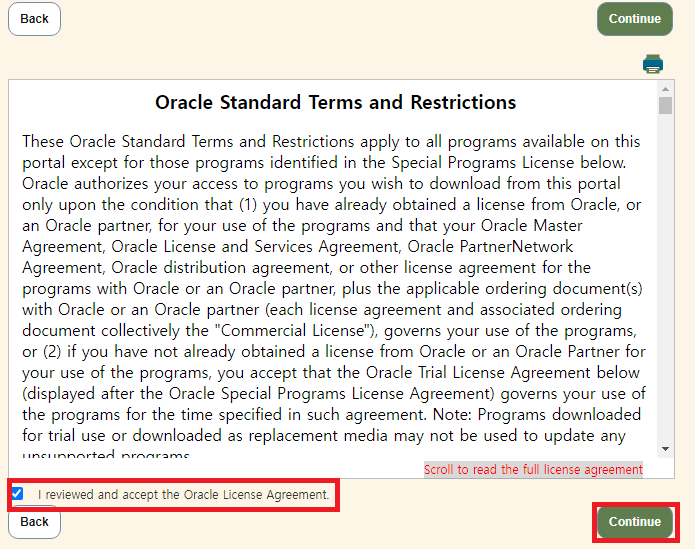

라이센스에 동의한다.

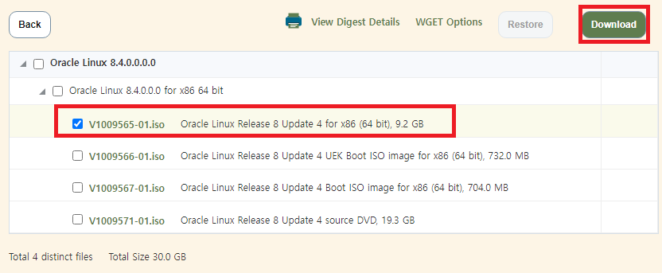

다운로드 버튼을 눌러 설치 파일을 받는다.

---
**2.2 리눅스 설치 시작**

VirtualBox에서 생성한 VM을 시작하고 ISO 파일을 삽입한다.

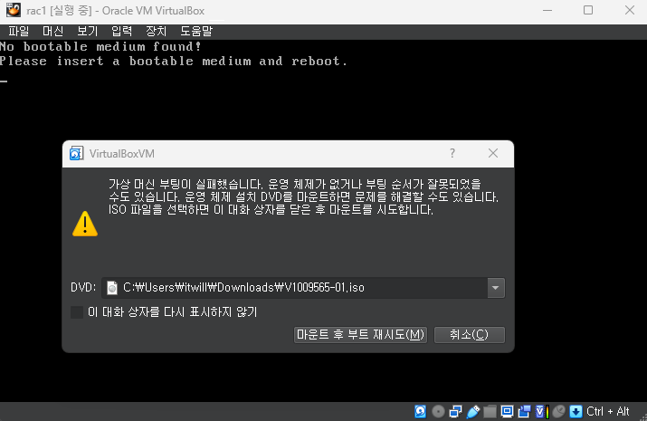

Install Oracle Linux 8.4.0를 선택한다.

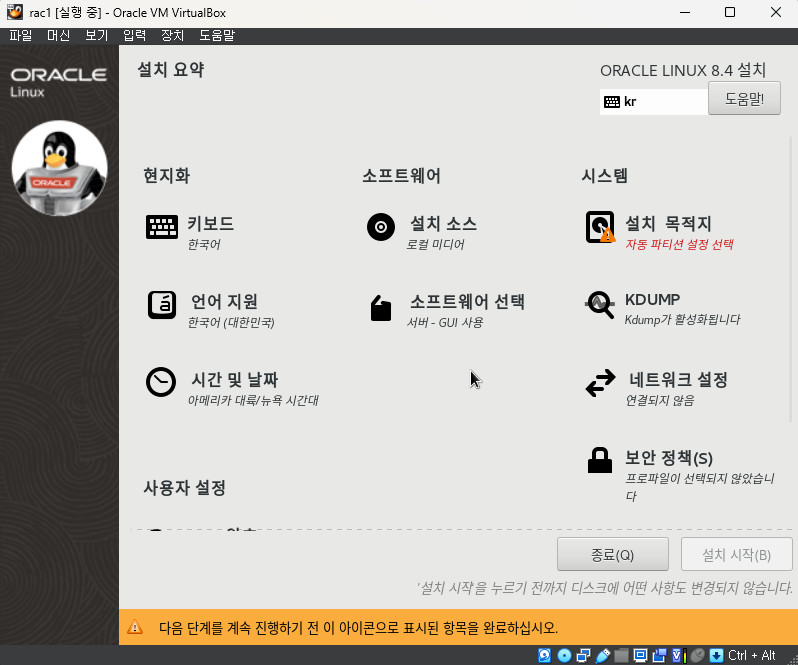

언어는 한국어 또는 영어를 선택한다.

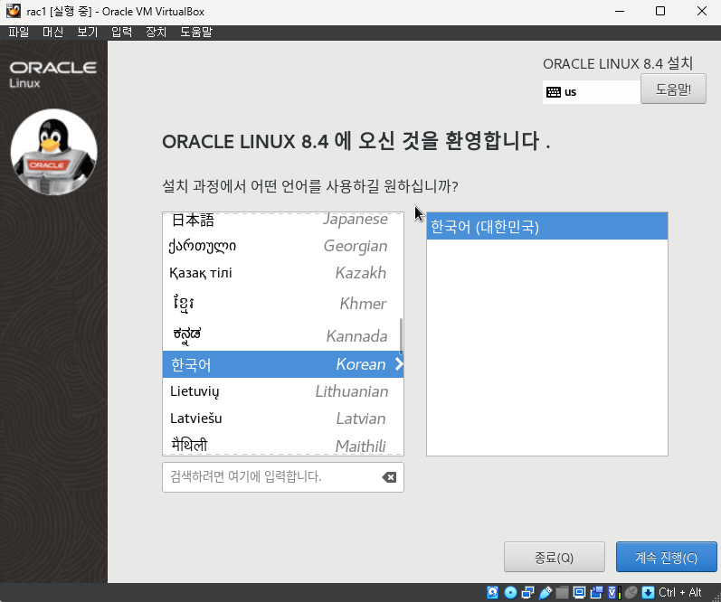

이제 모든 항목을 하나씩 설정해줄 것이다.

---
- **시간 및 날짜**

아시아의 서울로 설정한다.

---
- **소프트웨어 설치**

서버-GUI 사용에서 '레거시 UNIX 호환성', '개발용 툴'을 선택한다.

---

- **설치 목적지(디스크 파티션)**

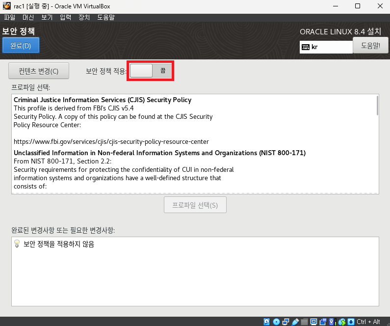

사용자 정의를 선택하고 완료를 누른다.

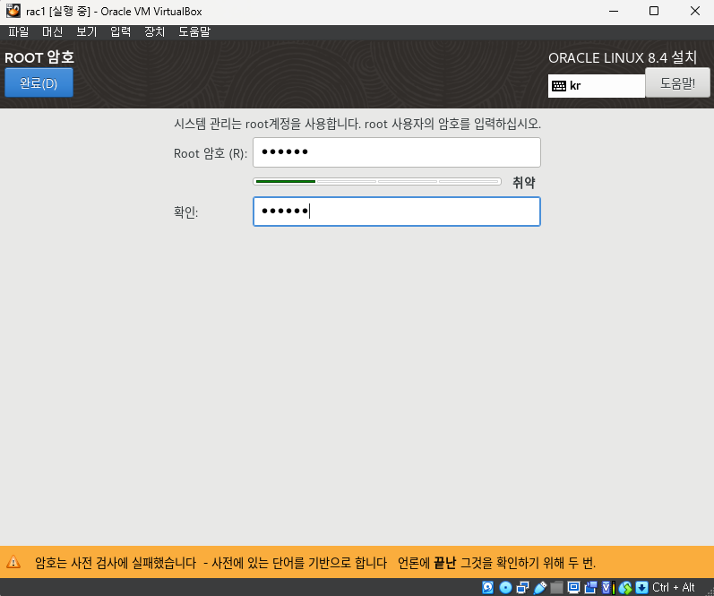

표준 파티션을 선택하고 마운트 지점을 다음과 같이 설정한다.
(swap은 메모리의 1~2배 정도 설정한다.)

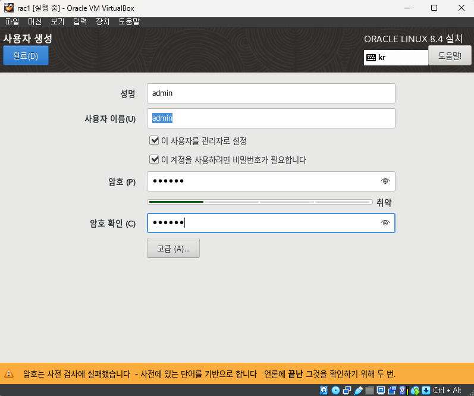

- **네트워크 및 호스트 이름**

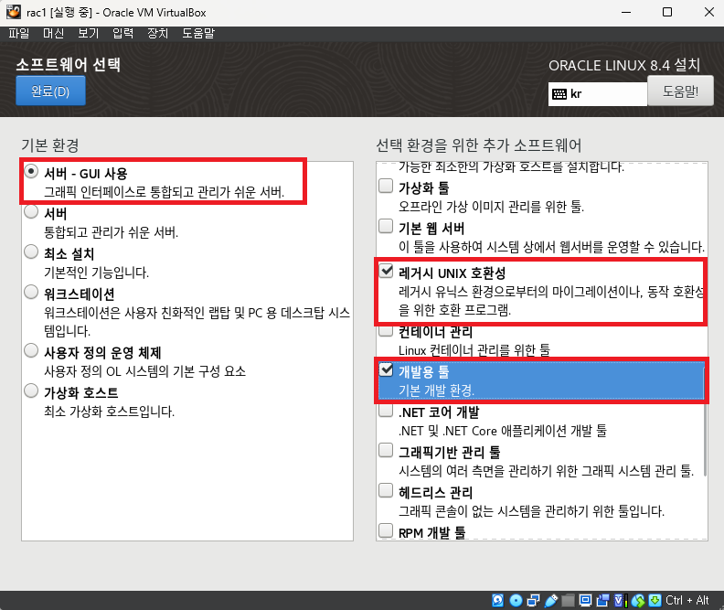

호스트 이름을 rac1로 변경하고 적용한다.

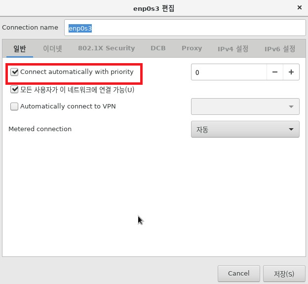

시작과 동시에 네트워크 자동연결 옵션을 체크한다.

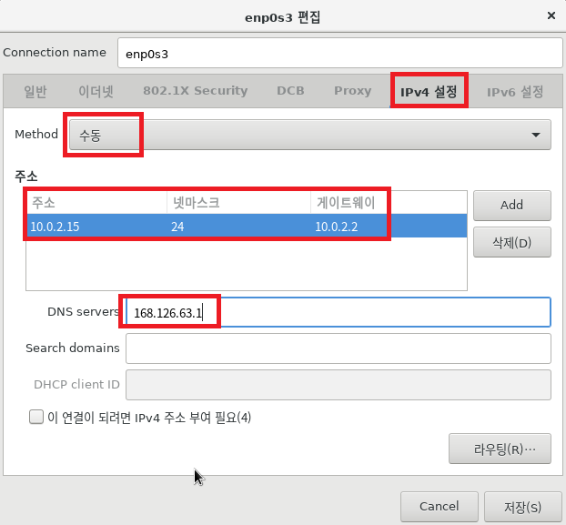

ipv4를 수동으로 설정한다. 서브넷 마스크의 255.255.255.0은 24로 입력해도 같은 값이다.

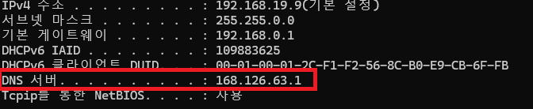

DNS서버는 윈도우의 cmd 창에서 ipconfig -all 할 때 나오는 DNS서버 이름으로 설정한다.

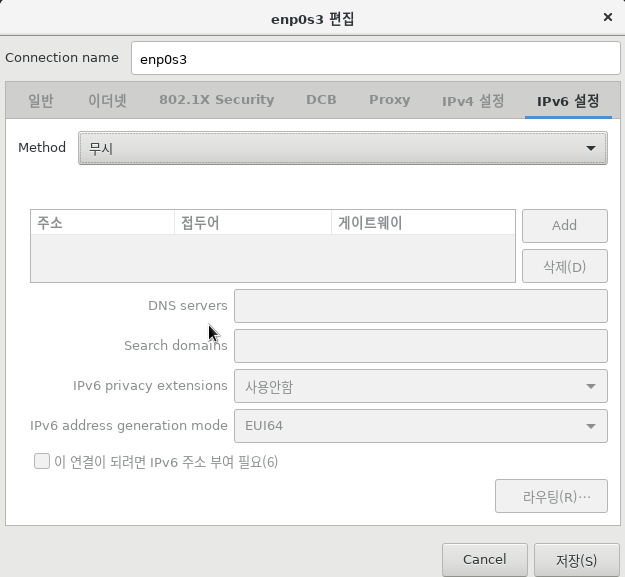

ipv6는 무시한다.

---
**2.4 사용자 설정**

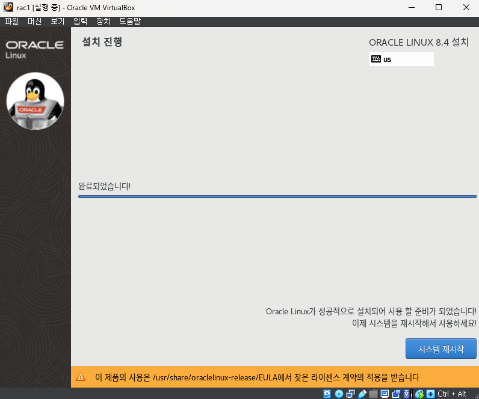

Root 암호를 설정한다.

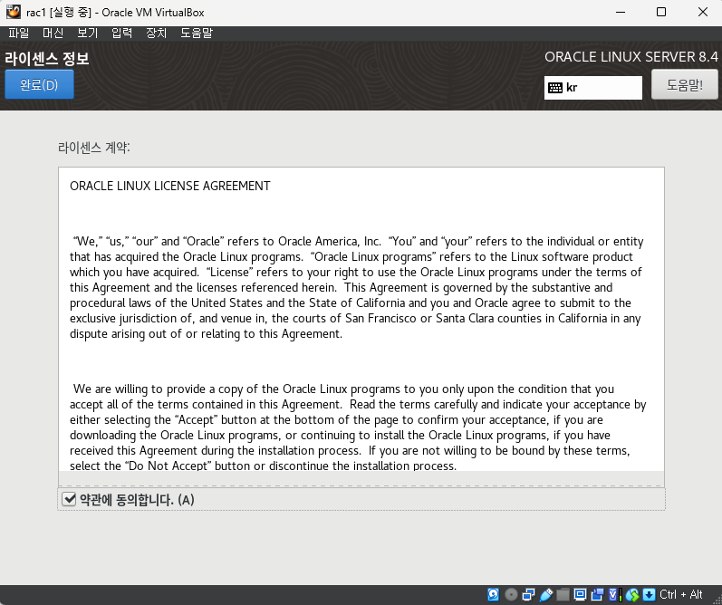

설치 시작을 누르고 기다린다.

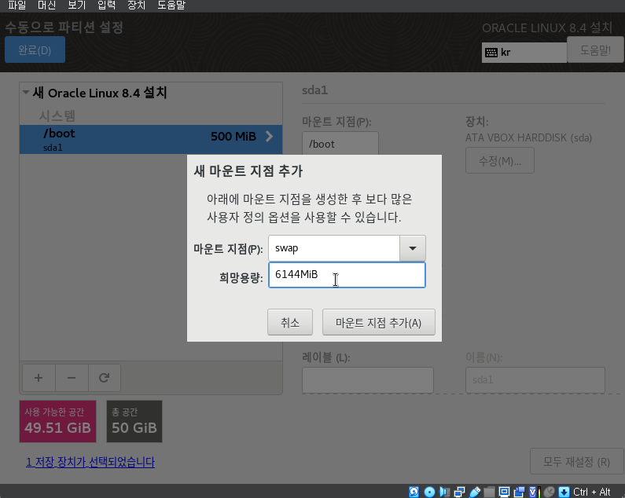

설치가 완료되면 재부팅한다.

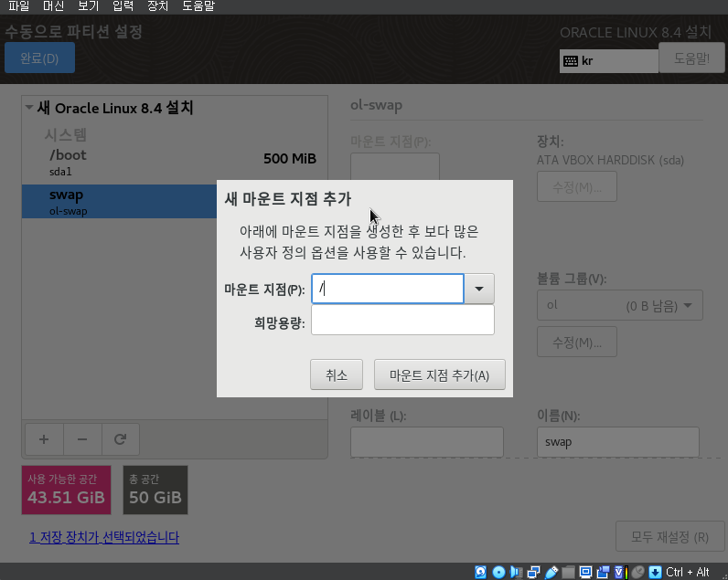

라이선스 정보에 동의한다.

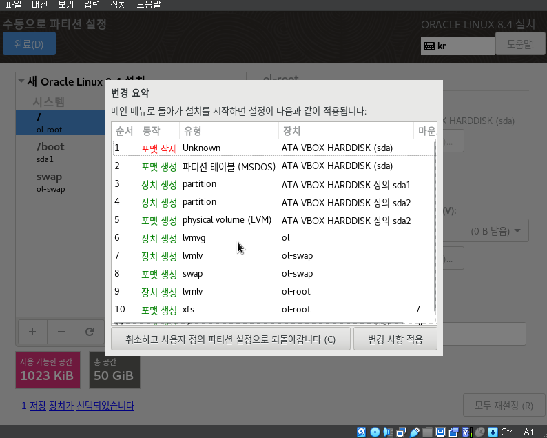

초기 설정을 완료하고 리눅스 바탕화면에 접속한다.

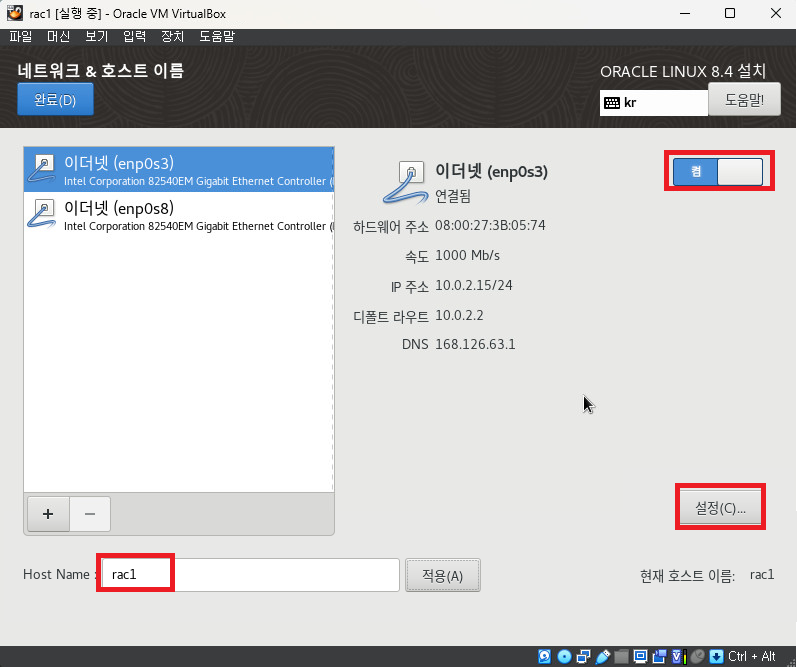
