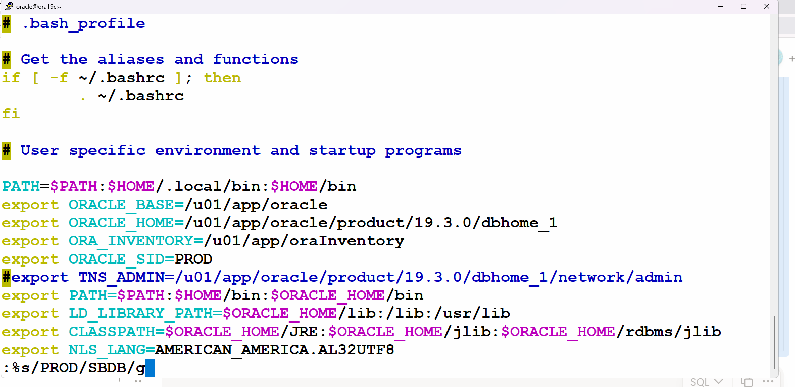

# 데이터가드 DB설치후 3

### 1. 원격지에 sbdb 쪽 서버로 접속해서 다음과 같이 디렉토리를 생성합니다

```sql
[oracle@ora19c ~]$ ifconfig
enp0s3: flags=4163<UP,BROADCAST,RUNNING,MULTICAST>  mtu 1500
        inet 192.168.33.81  netmask 255.255.0.0  broadcast 192.168.255.255
        inet6 fe80::7de9:eb06:fc18:42ef  prefixlen 64  scopeid 0x20<link>
        inet6 fe80::fe3f:c66a:8558:74aa  prefixlen 64  scopeid 0x20<link>
        ether 08:00:27:3c:e4:e7  txqueuelen 1000  (Ethernet)
        RX packets 5315  bytes 566037 (552.7 KiB)
        RX errors 0  dropped 0  overruns 0  frame 0
        TX packets 379  bytes 43693 (42.6 KiB)
        TX errors 0  dropped 0 overruns 0  carrier 0  collisions 0

[oracle@ora19c ~]$ mkdir -p /home/oracle/SBDB
```

### 2. 다시 primary db 쪽으로 와서 PROD 의 datafile , controlfile, redo logfile을 원격지에 SBDB 쪽으로 전송합니다.

```sql
[oracle@ora19c ~]$ ifconfig
enp0s3: flags=4163<UP,BROADCAST,RUNNING,MULTICAST>  mtu 1500
        inet 192.168.13.81  netmask 255.255.0.0  broadcast 192.168.255.255
        inet6 fe80::fe3f:c66a:8558:74aa  prefixlen 64  scopeid 0x20<link>
        ether 08:00:27:26:bf:38  txqueuelen 1000  (Ethernet)
        RX packets 8210  bytes 835917 (816.3 KiB)
        RX errors 0  dropped 0  overruns 0  frame 0
        TX packets 1990  bytes 258876 (252.8 KiB)
        TX errors 0  dropped 0 overruns 0  carrier 0  collisions 0

SYS@PROD> @datafile

FILE_NAME
--------------------------------------------------------------------------------
/u01/app/oracle/oradata/PROD/disk1/system01.dbf
/u01/app/oracle/oradata/PROD/disk2/sysaux01.dbf
/u01/app/oracle/oradata/PROD/disk4/undotbs01.dbf

SYS@PROD> @control

NAME
--------------------------------------------------------------------------------
/u01/app/oracle/oradata/PROD/disk1/ctrl1.ctl
/u01/app/oracle/oradata/PROD/disk2/ctrl2.ctl
/u01/app/oracle/oradata/PROD/disk3/ctrl3.ctl

SYS@PROD> @logfile

MEMBER
--------------------------------------------------------------------------------
/u01/app/oracle/oradata/PROD/disk4/redoG1M1.rdo
/u01/app/oracle/oradata/PROD/disk5/redoG1M2.rdo
/u01/app/oracle/oradata/PROD/disk4/redoG2M1.rdo
/u01/app/oracle/oradata/PROD/disk5/redoG2M2.rdo
/u01/app/oracle/oradata/PROD/disk4/redoG3M1.rdo
/u01/app/oracle/oradata/PROD/disk5/redoG3M2.rdo
/u01/app/oracle/oradata/PROD/disk4/redoG4M1.rdo
/u01/app/oracle/oradata/PROD/disk5/redoG4M2.rdo
/u01/app/oracle/oradata/PROD/disk4/redoG5M1.rdo
/u01/app/oracle/oradata/PROD/disk5/redoG5M2.rdo

10 rows selected.

SYS@PROD>
SYS@PROD> shutdown immediate
Database closed.
Database dismounted.
ORACLE instance shut down.
SYS@PROD>
SYS@PROD> exit

[oracle@ora19c ~]$ scp -rp /u01/app/oracle/oradata/PROD/* oracle@192.168.33.xx:/home/oracle/SBDB/

```

### prod 쪽의 disk1 ~ disk5 가 잘넘어왔는지 sbdb 쪽에서 확인합니다.

```sql
[oracle@ora19c SBDB]$ pwd
/home/oracle/SBDB
[oracle@ora19c SBDB]$ ls
disk1  disk2  disk3  disk4  disk5
[oracle@ora19c SBDB]$
[oracle@ora19c SBDB]$ cd disk1
[oracle@ora19c disk1]$ ls
ctrl1.ctl  system01.dbf
[oracle@ora19c disk1]$

```

### prod db 쪽에서 아카이브 로그 파일과 flashback database log 가 저장될 위치를 생성합니다.

```sql
[oracle@ora19c ~]$ echo $ORACLE_SID
PROD
[oracle@ora19c ~]$ cd
[oracle@ora19c ~]$
[oracle@ora19c ~]$ mkdir -p /home/oracle/PROD/arch
[oracle@ora19c ~]$ mkdir -p /home/oracle/PROD/flash
```

### sbdb 쪽에서도 아카이브 로그 파일과 flashback database log 가 저장될 위치를 생성합니다.

먼저 .bash_profile에서 SBDB 를 PROD 로 한번에 변경합니다.

```sql
[oracle@ora19c ~]$ ifconfig
enp0s3: flags=4163<UP,BROADCAST,RUNNING,MULTICAST>  mtu 1500
        inet 192.168.33.81  netmask 255.255.0.0  broadcast 192.168.255.255
        inet6 fe80::fe3f:c66a:8558:74aa  prefixlen 64  scopeid 0x20<link>
        inet6 fe80::7de9:eb06:fc18:42ef  prefixlen 64  scopeid 0x20<link>
        ether 08:00:27:3c:e4:e7  txqueuelen 1000  (Ethernet)
        RX packets 7121  bytes 699998 (683.5 KiB)
        RX errors 0  dropped 0  overruns 0  frame 0
        TX packets 556  bytes 66000 (64.4 KiB)
        TX errors 0  dropped 0 overruns 0  carrier 0  collisions 0

lo: flags=73<UP,LOOPBACK,RUNNING>  mtu 65536
        inet 127.0.0.1  netmask 255.0.0.0
        inet6 ::1  prefixlen 128  scopeid 0x10<host>
        loop  txqueuelen 1000  (Local Loopback)
        RX packets 0  bytes 0 (0.0 B)
        RX errors 0  dropped 0  overruns 0  frame 0
        TX packets 0  bytes 0 (0.0 B)
        TX errors 0  dropped 0 overruns 0  carrier 0  collisions 0

virbr0: flags=4099<UP,BROADCAST,MULTICAST>  mtu 1500
        inet 192.168.122.1  netmask 255.255.255.0  broadcast 192.168.122.255
        ether 52:54:00:f1:f4:eb  txqueuelen 1000  (Ethernet)
        RX packets 0  bytes 0 (0.0 B)
        RX errors 0  dropped 0  overruns 0  frame 0
        TX packets 0  bytes 0 (0.0 B)
        TX errors 0  dropped 0 overruns 0  carrier 0  collisions 0

[oracle@ora19c ~]$
[oracle@ora19c ~]$ vi .bash_profile

```



```sql
[oracle@ora19c ~]$ source .bash_profile
[oracle@ora19c ~]$ echo $ORACLE_SID
SBDB
[oracle@ora19c ~]$
[oracle@ora19c ~]$ ifconfig | grep 33
        inet 192.168.33.81  netmask 255.255.0.0  broadcast 192.168.255.255
[oracle@ora19c ~]$
[oracle@ora19c ~]$ cd
[oracle@ora19c ~]$
[oracle@ora19c ~]$ mkdir -p /home/oracle/SBDB/arch
[oracle@ora19c ~]$ mkdir -p /home/oracle/SBDB/flash
```

### 다시 prod 쪽으로 와서  primary db 를 mount 로 올리고 standby 용 controlfile을 생성하고 sbdb 로 scp 로 복사해서 넘겨줍니다.

<aside>
💡

반드시해야함

</aside>

```sql
[oracle@ora19c ~]$ sys

SQL*Plus: Release 19.0.0.0.0 - Production on Fri Apr 3 15:59:57 2026
Version 19.26.0.0.0

Copyright (c) 1982, 2024, Oracle.  All rights reserved.

Connected to an idle instance.

SYS@PROD> startup
ORACLE instance started.

Total System Global Area 1073739904 bytes
Fixed Size                  8947840 bytes
Variable Size             629145600 bytes
Database Buffers          427819008 bytes
Redo Buffers                7827456 bytes
Database mounted.
Database opened.
SYS@PROD>
SYS@PROD> shutdown immediate
Database closed.
Database dismounted.
ORACLE instance shut down.
SYS@PROD>
SYS@PROD>
SYS@PROD> startup mount
ORACLE instance started.

Total System Global Area 1073739904 bytes
Fixed Size                  8947840 bytes
Variable Size             629145600 bytes
Database Buffers          427819008 bytes
Redo Buffers                7827456 bytes
Database mounted.
SYS@PROD>
SYS@PROD> alter database create standby controlfile as '$HOME/physical.ctl' reuse;
-- REUSE의 핵심 의미: "덮어쓰기 허용"
Database altered.

SYS@PROD>
SYS@PROD> exit
Disconnected from Oracle Database 19c Enterprise Edition Release 19.0.0.0.0 - Production
Version 19.26.0.0.0
[oracle@ora19c ~]$
[oracle@ora19c ~]$ echo $HOME
/home/oracle
[oracle@ora19c ~]$ ls -l physical.ctl
-rw-r-----. 1 oracle oinstall 8634368  4월  3 16:02 physical.ctl
[oracle@ora19c ~]$
[oracle@ora19c ~]$
[oracle@ora19c ~]$ scp $HOME/physical.ctl oracle@192.168.33.81:/home/oracle/SBDB/disk1/ctrl1.ct     l
oracle@192.168.33.81s password:
physical.ctl                                                 100% 8432KB 106.4MB/s   00:00
[oracle@ora19c ~]$

[oracle@ora19c ~]$ scp $HOME/physical.ctl oracle@192.168.33.81:/home/oracle/SBDB/disk2/ctrl2.ctl
oracle@192.168.33.81s password:
physical.ctl                                                      100% 8432KB  56.5MB/s   00:00
[oracle@ora19c ~]$
[oracle@ora19c ~]$
[oracle@ora19c ~]$ scp $HOME/physical.ctl oracle@192.168.33.81:/home/oracle/SBDB/disk3/ctrl3.ctl
oracle@192.168.33.81's password:
physical.ctl                                                      100% 8432KB  90.5MB/s   00:00
[oracle@ora19c ~]$

```

SBDB 쪽에서 잘 넘어왔는지 확인합니다.

### sbdb 쪽에서 listener.ora 와 tnsnames.ora 를 구성합니다.

```sql
[oracle@ora19c disk3]$ echo $ORACLE_SID
SBDB
[oracle@ora19c disk3]$ cd $ORACLE_HOME
[oracle@ora19c dbhome_1]$ cd network
[oracle@ora19c network]$ cd admin
[oracle@ora19c admin]$ pwd
/u01/app/oracle/product/19.3.0/dbhome_1/network/admin
[oracle@ora19c admin]$ ls
listener.bak  listener_20260326.ora  shrept.lst
listener.ora  samples                tnsnames.ora
[oracle@ora19c admin]$
[oracle@ora19c admin]$ mv listener.ora listener.bak
[oracle@ora19c admin]$ vi listener.ora
# listener.ora Network Configuration File: /u01/app/oracle/product/19.3.0/dbhome_1/network/admin/listener.ora
# Generated by Oracle configuration tools.

LISTENER =
  (DESCRIPTION_LIST =
    (DESCRIPTION =
      (ADDRESS = (PROTOCOL = TCP)(HOST = 192.168.33.81)(PORT = 1521))
      (ADDRESS = (PROTOCOL = IPC)(KEY = EXTPROC1521))
    )
  )
SID_LIST_LISTENER=
  (SID_LIST =
    (SID_DESC =
      (ORACLE_HOME=/u01/app/oracle/product/19.3.0/dbhome_1)
      (SID_NAME=SBDB)
     )
   )
   
   
 cat /etc/hosts
 127.0.0.1   localhost localhost.localdomain localhost4 localhost4.localdomain4
::1         localhost localhost.localdomain localhost6 localhost6.localdomain6
192.168.23.224 MIRA

[oracle@ora19c admin]$ lsnrctl start

LSNRCTL for Linux: Version 19.0.0.0.0 - Production on 03-APR-2026 16:11:40

Copyright (c) 1991, 2024, Oracle.  All rights reserved.

Starting /u01/app/oracle/product/19.3.0/dbhome_1/bin/tnslsnr: please wait...

TNSLSNR for Linux: Version 19.0.0.0.0 - Production
System parameter file is /u01/app/oracle/product/19.3.0/dbhome_1/network/admin/listener.ora
Log messages written to /u01/app/oracle/diag/tnslsnr/ora19c/listener/alert/log.xml
Listening on: (DESCRIPTION=(ADDRESS=(PROTOCOL=tcp)(HOST=192.168.33.81)(PORT=1521)))
Listening on: (DESCRIPTION=(ADDRESS=(PROTOCOL=ipc)(KEY=EXTPROC1521)))

Connecting to (DESCRIPTION=(ADDRESS=(PROTOCOL=TCP)(HOST=192.168.33.81)(PORT=1521)))
STATUS of the LISTENER
------------------------
Alias                     LISTENER
Version                   TNSLSNR for Linux: Version 19.0.0.0.0 - Production
Start Date                03-APR-2026 16:11:42
Uptime                    0 days 0 hr. 0 min. 0 sec
Trace Level               off
Security                  ON: Local OS Authentication
SNMP                      OFF
Listener Parameter File   /u01/app/oracle/product/19.3.0/dbhome_1/network/admin/listener.ora
Listener Log File         /u01/app/oracle/diag/tnslsnr/ora19c/listener/alert/log.xml
Listening Endpoints Summary...
  (DESCRIPTION=(ADDRESS=(PROTOCOL=tcp)(HOST=192.168.33.81)(PORT=1521)))
  (DESCRIPTION=(ADDRESS=(PROTOCOL=ipc)(KEY=EXTPROC1521)))
Services Summary...
Service "SBDB" has 1 instance(s).
  Instance "SBDB", status UNKNOWN, has 1 handler(s) for this service...
The command completed successfully
[oracle@ora19c admin]$
[oracle@ora19c admin]$
[oracle@ora19c admin]$ cat tnsnames.ora
# tnsnames.ora Network Configuration File: /u01/app/oracle/product/19.3.0/dbhome_1/network/admin/tnsnames.ora
# Generated by Oracle configuration tools.

PROD =
(DESCRIPTION =
  (ADDRESS = (PROTOCOL = TCP)(HOST = 192.168.13.81)(PORT = 1521))
  (CONNECT_DATA =
  (SERVER = DEDICATED)
  (SERVICE_NAME = PROD)
  )
)

SBDB =
(DESCRIPTION =
  (ADDRESS = (PROTOCOL = TCP)(HOST = 192.168.33.81)(PORT = 1521))
  (CONNECT_DATA =
  (SERVER = DEDICATED)
  (SERVICE_NAME = SBDB)
  )
)

[oracle@ora19c admin]$

```

### primary db 에서 패스워드 파일을 sbdb 쪽으로 전송합니다.

<aside>
💡

위에서 했음 확인만

</aside>

```sql
[oracle@ora19c ~]$ cd $ORACLE_HOME
[oracle@ora19c dbhome_1]$ cd dbs
[oracle@ora19c dbs]$ pwd
/u01/app/oracle/product/19.3.0/dbhome_1/dbs
[oracle@ora19c dbs]$ ls
arch1_14_1229442941.dbf  c-640158980-20260326-00  hc_SBDB.dat      initPROD.ora  snapcf_PROD.f
arch1_15_1229442941.dbf  c-640158980-20260327-00  hc_orcl.dat      lkORCL_TES    snapcf_SBDB.f
c-640158980-20260323-00  c-640158980-20260330-00  hc_orcltest.dat  lkPROD
c-640158980-20260324-00  hc_PROD.dat              hc_yys.dat       lkSBDB
[oracle@ora19c dbs]$
[oracle@ora19c dbs]$
[oracle@ora19c dbs]$ echo $ORACLE_SID
PROD
[oracle@ora19c dbs]$ orapwd file=orapwPROD password=oracle format=12 force=y
[oracle@ora19c dbs]$
[oracle@ora19c dbs]$ cp orapwPROD orapwSBDB
[oracle@ora19c dbs]$
[oracle@ora19c dbs]$ scp orapwSBDB oracle@192.168.33.81:/u01/app/oracle/product/19.3.0/dbhome_1/dbs/
oracle@192.168.33.81's password:
orapwSBDB                                                         100% 2048     1.1MB/s   00:00
[oracle@ora19c dbs]$
[oracle@ora19c dbs]$

[oracle@ora19c dbs]$ sqlplus sys/oracle@prod as sysdba

SQL*Plus: Release 19.0.0.0.0 - Production on Fri Apr 3 16:17:39 2026
Version 19.26.0.0.0

Copyright (c) 1982, 2024, Oracle.  All rights reserved.

Connected to:
Oracle Database 19c Enterprise Edition Release 19.0.0.0.0 - Production
Version 19.26.0.0.0

SYS@prod>

```

### sbdb 쪽에서도 리스너 통해서 sys 로 접속이 되는지 확인해야합니다.

```sql
[oracle@ora19c admin]$ cd $ORACLE_HOME/dbs
[oracle@ora19c dbs]$ ls
c-640158980-20260323-00  hc_SBDB.dat      lkSBDB
c-640158980-20260324-00  hc_orcl.dat      orapwSBDB
c-640158980-20260326-00  hc_orcltest.dat  snapcf_PROD.f
c-640158980-20260327-00  hc_yys.dat       snapcf_SBDB.f
c-640158980-20260330-00  lkORCL_TES
hc_PROD.dat              lkPROD
[oracle@ora19c dbs]$
[oracle@ora19c dbs]$ sqlplus sys/oracle@sbdb as sysdba

SQL*Plus: Release 19.0.0.0.0 - Production on Fri Apr 3 16:19:07 2026
Version 19.26.0.0.0

Copyright (c) 1982, 2024, Oracle.  All rights reserved.

Connected to an idle instance.

SYS@sbdb>

```

### sbdb 쪽에서 파라미터 파일인 initSBDB.ora 를 생성합니다.

```sql

[oracle@ora19c ~]$ sbdb
[oracle@ora19c ~]$
[oracle@ora19c ~]$ echo $ORACLE_SID
SBDB
[oracle@ora19c ~]$
[oracle@ora19c ~]$

$ cd $ORACLE_HOME/dbs

$ vi  initSBDB.ora

compatible=19.3.0.0
control_files = (/home/oracle/SBDB/disk1/ctrl1.ctl ,
                 /home/oracle/SBDB/disk2/ctrl2.ctl ,
                 /home/oracle/SBDB/disk3/ctrl3.ctl )
db_block_size=8192
db_name=PROD
service_names=SBDB
global_names=true
job_queue_processes=10
open_cursors=500
processes=100
remote_login_passwordfile='EXCLUSIVE'
memory_target=1G
undo_management='AUTO'
undo_tablespace='UNDOTBS1'
db_recovery_file_dest_size=4G
db_recovery_file_dest=/home/oracle/SBDB/flash
db_unique_name=SBDB
standby_file_management=auto
db_file_name_convert='/u01/app/oracle/oradata~~/~~PROD','/home/oracle/SBDB'
log_file_name_convert='/u01/app/oracle/oradata/PROD','/home/oracle/SBDB'
log_archive_dest_1='location=/home/oracle/SBDB/arch valid_for=(all_logfiles, all_roles)'
log_archive_dest_2='service=PROD LGWR SYNC AFFIRM valid_for=(online_logfiles, primary_role)'
#standby_archive_dest=/home/oracle/SBDB/arch
#recovery_parallelism=4
fal_server=PROD
fal_client=SBDB
```

### primary db 쪽으로 와서 standby 용 redo logfile을 생성합니다.

<aside>
💡

instance가 꺼져있으면 startup mount

</aside>

```sql
[oracle@ora19c ~]$ sys

SQL*Plus: Release 19.0.0.0.0 - Production on Thu Oct 16 15:51:58 2025
Version 19.3.0.0.0

Copyright (c) 1982, 2019, Oracle.  All rights reserved.

Connected to:
Oracle Database 19c Enterprise Edition Release 19.0.0.0.0 - Production
Version 19.3.0.0.0

SYS @ PROD > @i

INSTANCE_NAME    STATUS
---------------- ------------
PROD             MOUNTED

SYS @ PROD > @log

    GROUP# STATUS            SEQUENCE# ARC
---------- ---------------- ---------- ---
         1 CURRENT                  16 NO
         2 INACTIVE                 12 YES
         5 INACTIVE                 15 YES
         4 INACTIVE                 14 YES
         3 INACTIVE                 13 YES

ALTER DATABASE ADD STANDBY LOGFILE 
  GROUP 10 ('/u01/app/oracle/oradata/PROD/stby_redo10.log') SIZE 100M,
  GROUP 11 ('/u01/app/oracle/oradata/PROD/stby_redo11.log') SIZE 100M,
  GROUP 12 ('/u01/app/oracle/oradata/PROD/stby_redo12.log') SIZE 100M,
  GROUP 13 ('/u01/app/oracle/oradata/PROD/stby_redo13.log') SIZE 100M,
  GROUP 14 ('/u01/app/oracle/oradata/PROD/stby_redo14.log') SIZE 100M,
  GROUP 15 ('/u01/app/oracle/oradata/PROD/stby_redo15.log') SIZE 100M;

SYS @ PROD > SYS @ PROD > select group#, bytes/1024/1024
                           from v$standby_log;

    GROUP# BYTES/1024/1024
---------- ---------------
        10             100
        11             100
        12             100
        13             100
        14             100
        15             100

6 rows selected.

```

### standby db 에서도 standby 용 redo logfile 을 생성합니다.

```sql
[oracle@ora19c ~]$ sys

SQL*Plus: Release 19.0.0.0.0 - Production on Thu Oct 16 15:58:56 2025
Version 19.3.0.0.0

Copyright (c) 1982, 2019, Oracle.  All rights reserved.

Connected to an idle instance.

SYS @ SBDB > startup pfile=$ORACLE_HOME/dbs/initSBDB.ora
ORACLE instance started.

Total System Global Area 1073737800 bytes
Fixed Size                  8904776 bytes
Variable Size             616562688 bytes
Database Buffers          440401920 bytes
Redo Buffers                7868416 bytes
Database mounted.
Database opened.
SYS @ SBDB >
SYS @ SBDB > exit;
Disconnected from Oracle Database 19c Enterprise Edition Release 19.0.0.0.0 - Production
Version 19.3.0.0.0

[oracle@ora19c ~]$
[oracle@ora19c ~]$ cd /u01/app/oracle/oradata/
[oracle@ora19c oradata]$
[oracle@ora19c oradata]$ ls
PROD
[oracle@ora19c oradata]$ mkdir SBDB
[oracle@ora19c oradata]$
[oracle@ora19c oradata]$

SYS @ SBDB >
ALTER DATABASE ADD STANDBY LOGFILE 
  GROUP 10 ('/u01/app/oracle/oradata/SBDB/stby_redo10.log') SIZE 100M,
  GROUP 11 ('/u01/app/oracle/oradata/SBDB/stby_redo11.log') SIZE 100M,
  GROUP 12 ('/u01/app/oracle/oradata/SBDB/stby_redo12.log') SIZE 100M,
  GROUP 13 ('/u01/app/oracle/oradata/SBDB/stby_redo13.log') SIZE 100M,
  GROUP 14 ('/u01/app/oracle/oradata/SBDB/stby_redo14.log') SIZE 100M,
  GROUP 15 ('/u01/app/oracle/oradata/SBDB/stby_redo15.log') SIZE 100M;
  
  SYS @ SBDB > @log

    GROUP# STATUS            SEQUENCE# ARC
---------- ---------------- ---------- ---
         1 CURRENT                  16 NO
         2 INACTIVE                 12 YES
         3 INACTIVE                 13 YES
         4 INACTIVE                 14 YES
         5 INACTIVE                 15 YES

SYS @ SBDB > select group#, bytes/1024/1024
               from v$standby_log;
  
    GROUP# BYTES/1024/1024
---------- ---------------
        10             100
        11             100
        12             100
        13             100
        14             100
        15             100

6 rows selected.
```

## Standby(SBDB)를 Managed Recovery로 전환

- SBDB에서 수행

```bash
sbdb
echo $ORACLE_SID
# SBDB
sqlplus / as sysdba
```

```sql
select instance_name from v$instance;

shutdown immediate;
startup mount;

alter database flashback on;

-- MRP 확인(초기에는 안 뜰 수 있음)
select process, status from v$managed_standby;

-- Managed Recovery 시작
recover managed standby database disconnect;

-- MRP 재확인
select process, status from v$managed_standby;

-- 인스턴스 상태 확인
select status from v$instance;
-- STATUS: MOUNTED
```

---

## 13) 동기화/정상 동작 확인

### 13-1. PROD vs SBDB 데이터파일 개수 동일 여부

- PROD

```sql
select name from v$datafile;
```

- SBDB

```sql
select name from v$datafile;
```

### 13-2. Primary(PROD) OPEN

```bash
prod
sqlplus / as sysdba
```

```sql
select instance_name from v$instance;

alter database open;
```

### 13-3. PROD에서 테이블스페이스 생성 → SBDB 자동 반영 확인

```sql
create tablespace ts9000
datafile '/u01/app/oracle/oradata/PROD/disk2/ts9000.dbf' size 10m;

-- 로그 스위치(아카이브를 넘겨 동기화 촉진)
alter system switch logfile;
```

### 13-4. 양쪽에서 datafile 목록 재확인

- PROD

```sql
select name from v$datafile;
```

- SBDB

```sql
select name from v$datafile;
```