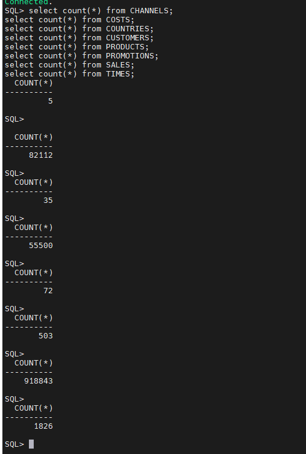

# V1.0 프로그램 검증

> 일반 테이블 건수 확인
> 

```jsx
select count(*) from CHANNELS;
select count(*) from COSTS;
select count(*) from COUNTRIES;
select count(*) from CUSTOMERS;
select count(*) from PRODUCTS;
select count(*) from PROMOTIONS;
select count(*) from SALES;
select count(*) from TIMES;
```



> 테이블 데이터 삭제 전 제약조건 비활성화
> 

```jsx
**DECLARE
    -- 대상 테이블 목록 정의
    TYPE t_tab_names IS TABLE OF VARCHAR2(30);
    v_tabs t_tab_names := t_tab_names('CUSTOMERS', 'COUNTRIES', 'PRODUCTS', 'PROMOTIONS', 'TIMES');
BEGIN
    FOR i IN 1 .. v_tabs.COUNT LOOP
        -- 해당 테이블에 속한 모든 제약조건 조회
        FOR c IN (SELECT constraint_name 
                  FROM user_constraints 
                  WHERE table_name = v_tabs(i)
                    AND status = 'ENABLED') 
        LOOP
            BEGIN
                -- CASCADE 옵션을 붙여 자식 제약조건까지 함께 비활성화
                EXECUTE IMMEDIATE 'ALTER TABLE ' || v_tabs(i) || 
                                  ' DISABLE CONSTRAINT ' || c.constraint_name || ' CASCADE';
                
                DBMS_OUTPUT.PUT_LINE('Disabled: ' || v_tabs(i) || '.' || c.constraint_name);
            EXCEPTION
                WHEN OTHERS THEN
                    DBMS_OUTPUT.PUT_LINE('Error disabling ' || c.constraint_name || ': ' || SQLERRM);
            END;
        END LOOP;
    END LOOP;
END;
/**
```

> 테이블 데이터 삭제 후 block수 및 hwm확인
> 

```jsx
delete from CUSTOMERS;
delete from COUNTRIES;
delete from PRODUCTS;
delete from PROMOTIONS;
delete from TIMES;

```


> reorg 전 후 블록 수 와 hwm 수위 비교
> 

```jsx
[oracle@ora19c Reorg]$ sh reorg_execute.sh
[2026-03-23 18:32:09] Step 0: Capturing pre-reorganization statistics...
[2026-03-23 18:32:09] Capturing schema stats for SH2 into ./logs/pre_reorg_stats.txt...
CHANNELS,8,0
COUNTRIES,8,0
CUSTOMERS,1552,0
PRODUCTS,8,0
PROMOTIONS,16,0
SUPPLEMENTARY_DEMOGRAPHICS,136,0
TIMES,64,0
[2026-03-23 18:32:11] Step 1: Generating list of tables to reorganize...
COUNTRIES
CUSTOMERS
PROMOTIONS
PRODUCTS
TIMES
CHANNELS
SUPPLEMENTARY_DEMOGRAPHICS
[2026-03-23 18:32:11] Step 2: Generating list of indexes to rebuild...
PRODUCTS_PROD_SUBCAT_IX
PRODUCTS_PROD_CAT_IX
CHANNELS_PK
SUPP_DEMO_PK
[2026-03-23 18:32:12] Step 3: Reorganizing tables in parallel (Job Concurrency=2, SQL DOP=4)...
[2026-03-23 18:32:12]   -> Moving table: COUNTRIES
[2026-03-23 18:32:12]   -> Moving table: CUSTOMERS
[2026-03-23 18:32:14]   <- Move & Noparallel complete: COUNTRIES
[2026-03-23 18:32:14]   <- Move & Noparallel complete: CUSTOMERS
[2026-03-23 18:32:14]   -> Moving table: PROMOTIONS
[2026-03-23 18:32:14]   -> Moving table: PRODUCTS
[2026-03-23 18:32:14]   <- Move & Noparallel complete: PROMOTIONS
[2026-03-23 18:32:14]   <- Move & Noparallel complete: PRODUCTS
[2026-03-23 18:32:14]   -> Moving table: TIMES
[2026-03-23 18:32:14]   -> Moving table: CHANNELS
[2026-03-23 18:32:14]   <- Move & Noparallel complete: TIMES
[2026-03-23 18:32:15]   <- Move & Noparallel complete: CHANNELS
[2026-03-23 18:32:15]   -> Moving table: SUPPLEMENTARY_DEMOGRAPHICS
[2026-03-23 18:32:15]   <- Move & Noparallel complete: SUPPLEMENTARY_DEMOGRAPHICS
[2026-03-23 18:32:15] All table MOVE operations completed.
[2026-03-23 18:32:15] Step 4: Rebuilding indexes in parallel (Job Concurrency=2, SQL DOP=4)...
[2026-03-23 18:32:15]   -> Rebuilding index: PRODUCTS_PROD_SUBCAT_IX
[2026-03-23 18:32:15]   -> Rebuilding index: PRODUCTS_PROD_CAT_IX
[2026-03-23 18:32:16]   <- Rebuild & Noparallel complete: PRODUCTS_PROD_SUBCAT_IX
[2026-03-23 18:32:16]   <- Rebuild & Noparallel complete: PRODUCTS_PROD_CAT_IX
[2026-03-23 18:32:16]   -> Rebuilding index: CHANNELS_PK
[2026-03-23 18:32:16]   -> Rebuilding index: SUPP_DEMO_PK
[2026-03-23 18:32:16]   <- Rebuild & Noparallel complete: SUPP_DEMO_PK
[2026-03-23 18:32:16]   <- Rebuild & Noparallel complete: CHANNELS_PK
[2026-03-23 18:32:16] All index REBUILD operations completed.
[2026-03-23 18:32:16] Step 5: Gathering fresh statistics for schema SH2...
SP2-0103: Nothing in SQL buffer to run.
[2026-03-23 18:32:36] Schema statistics gathering complete.
[2026-03-23 18:32:36] Step 6: Capturing post-reorganization statistics...
[2026-03-23 18:32:36] Capturing schema stats for SH2 into ./logs/post_reorg_stats.txt...
CHANNELS,8,0
COUNTRIES,0,0
CUSTOMERS,0,0
PRODUCTS,0,0
PROMOTIONS,0,0
SUPPLEMENTARY_DEMOGRAPHICS,128,0
TIMES,0,0
[2026-03-23 18:32:37] Step 7: Generating comparison report...
[2026-03-23 18:32:37] Generating comparison report...
[2026-03-23 18:32:37] Comparison report generated at ./logs/reorg_comparison_report.txt
===========================================================================================
 Reorganization Comparison Report for Schema: SH2
===========================================================================================

HWM (High Water Mark) is represented by the 'BLOCKS' count.
A reduction in BLOCKS indicates successful HWM lowering and space reclamation.

TABLE_NAME                          | BLOCKS (BEFORE)      | BLOCKS (AFTER)       | SAVED
-------------------------------------------------------------------------------------------
CHANNELS                            | 8                    | 8                    | 0
COUNTRIES                           | 8                    | 0                    | 8
CUSTOMERS                           | 1552                 | 0                    | 1552
PRODUCTS                            | 8                    | 0                    | 8
PROMOTIONS                          | 16                   | 0                    | 16
SUPPLEMENTARY_DEMOGRAPHICS          | 136                  | 128                  | 8
TIMES                               | 64                   | 0                    | 64

-------------------------------------------------------------------------------------------
TOTALS
                                    | 1792                 | 136                  | 1656
[2026-03-23 18:32:37] Reorganization script finished successfully.
[2026-03-23 18:32:37] Please check the full log at: ./logs/reorg_execute_20260323_183209.log
[2026-03-23 18:32:37] Comparison report is available at: ./logs/reorg_comparison_report.txt
[oracle@ora19c Reorg]$

```

<aside>
💡

데이터를 삭제하지 않은 테이블 SUPPLEMENTARY_DEMOGRAPHICS외 6개의 테이블의 BLOCKS가 확연히 줄어든것을 확인할 수 있었다.

</aside>

> 과제
> 

```jsx
IOT, PARTITION 테이블의 REORG 기능 추가
```