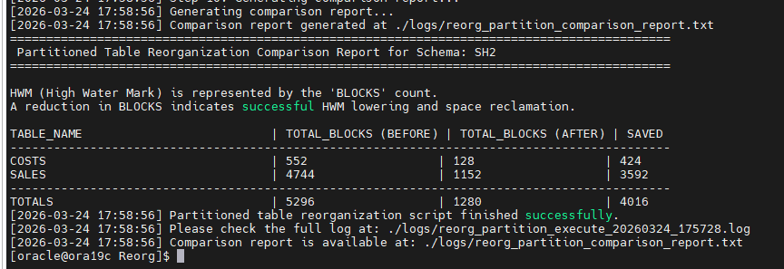

# V1.1검증(partion table reorg)

<aside>
💡

v1.1은 파티션 테이블을 reorg하는 기능이 추가되었다.

</aside>

> 스크립트 실행 전
> 

```jsx
SQL> conn sh2/sh2
Connected.
SQL> select count(*) from costs;

  COUNT(*)
----------
     82112

SQL> select count(*) from sales;

  COUNT(*)
----------
    918843

SQL> delete from costs where rownum <=60000;

~~60000 rows deleted.

SQL> delete from sales where ro~~wnum <=700000;

700000 rows deleted.

SQL> select count(*) from costs;

  COUNT(*)
----------
     22112

SQL> select count(*) from sales;

  COUNT(*)
----------
    218843

SQL> commit;

Commit complete.

SQL> select table_name, blocks from user_tables where table_name = 'SALES';

TABLE_NAME
--------------------------------------------------------------------------------
    BLOCKS
----------
SALES
      4744

SQL> select table_name, blocks from user_tables where table_name = 'COSTS';

TABLE_NAME
--------------------------------------------------------------------------------
    BLOCKS
----------
COSTS
       552

SQL>

```

> 스크립트 실행 후
> 



> reorg후 인덱스 상태 확인
> 

```jsx
SQL> @verify

INDEX_OWNER     INDEX_NAME                PARTITION_NAME       STATUS
--------------- ------------------------- -------------------- ---------------
SH2             SALES_CHANNEL_BIX         SALES_2018           USABLE
SH2             SALES_CHANNEL_BIX         SALES_H1_2019        USABLE
SH2             SALES_CHANNEL_BIX         SALES_H2_2019        USABLE
SH2             SALES_CHANNEL_BIX         SALES_Q1_2020        USABLE
SH2             SALES_CHANNEL_BIX         SALES_Q1_2021        USABLE
SH2             SALES_CHANNEL_BIX         SALES_Q1_2022        USABLE
SH2             SALES_CHANNEL_BIX         SALES_Q2_2020        USABLE
SH2             SALES_CHANNEL_BIX         SALES_Q2_2021        USABLE
SH2             SALES_CHANNEL_BIX         SALES_Q2_2022        USABLE
SH2             SALES_CHANNEL_BIX         SALES_Q3_2020        USABLE
SH2             SALES_CHANNEL_BIX         SALES_Q3_2021        USABLE
SH2             SALES_CHANNEL_BIX         SALES_Q3_2022        USABLE
SH2             SALES_CHANNEL_BIX         SALES_Q4_2020        USABLE
SH2             SALES_CHANNEL_BIX         SALES_Q4_2021        USABLE
SH2             SALES_CHANNEL_BIX         SALES_Q4_2022        USABLE
SH2             SALES_CUST_BIX            SALES_2018           USABLE
SH2             SALES_CUST_BIX            SALES_H1_2019        USABLE
SH2             SALES_CUST_BIX            SALES_H2_2019        USABLE
SH2             SALES_CUST_BIX            SALES_Q1_2020        USABLE
SH2             SALES_CUST_BIX            SALES_Q1_2021        USABLE
SH2             SALES_CUST_BIX            SALES_Q1_2022        USABLE
SH2             SALES_CUST_BIX            SALES_Q2_2020        USABLE
SH2             SALES_CUST_BIX            SALES_Q2_2021        USABLE
SH2             SALES_CUST_BIX            SALES_Q2_2022        USABLE
SH2             SALES_CUST_BIX            SALES_Q3_2020        USABLE
SH2             SALES_CUST_BIX            SALES_Q3_2021        USABLE
SH2             SALES_CUST_BIX            SALES_Q3_2022        USABLE
SH2             SALES_CUST_BIX            SALES_Q4_2020        USABLE
SH2             SALES_CUST_BIX            SALES_Q4_2021        USABLE
SH2             SALES_CUST_BIX            SALES_Q4_2022        USABLE
SH2             SALES_PROD_BIX            SALES_2018           USABLE
SH2             SALES_PROD_BIX            SALES_H1_2019        USABLE
SH2             SALES_PROD_BIX            SALES_H2_2019        USABLE
SH2             SALES_PROD_BIX            SALES_Q1_2020        USABLE
SH2             SALES_PROD_BIX            SALES_Q1_2021        USABLE
SH2             SALES_PROD_BIX            SALES_Q1_2022        USABLE
SH2             SALES_PROD_BIX            SALES_Q2_2020        USABLE
SH2             SALES_PROD_BIX            SALES_Q2_2021        USABLE
SH2             SALES_PROD_BIX            SALES_Q2_2022        USABLE
SH2             SALES_PROD_BIX            SALES_Q3_2020        USABLE
SH2             SALES_PROD_BIX            SALES_Q3_2021        USABLE
SH2             SALES_PROD_BIX            SALES_Q3_2022        USABLE
SH2             SALES_PROD_BIX            SALES_Q4_2020        USABLE
SH2             SALES_PROD_BIX            SALES_Q4_2021        USABLE
SH2             SALES_PROD_BIX            SALES_Q4_2022        USABLE
SH2             SALES_PROMO_BIX           SALES_2018           USABLE
SH2             SALES_PROMO_BIX           SALES_H1_2019        USABLE
SH2             SALES_PROMO_BIX           SALES_H2_2019        USABLE
SH2             SALES_PROMO_BIX           SALES_Q1_2020        USABLE
SH2             SALES_PROMO_BIX           SALES_Q1_2021        USABLE
SH2             SALES_PROMO_BIX           SALES_Q1_2022        USABLE
SH2             SALES_PROMO_BIX           SALES_Q2_2020        USABLE
SH2             SALES_PROMO_BIX           SALES_Q2_2021        USABLE
SH2             SALES_PROMO_BIX           SALES_Q2_2022        USABLE
SH2             SALES_PROMO_BIX           SALES_Q3_2020        USABLE
SH2             SALES_PROMO_BIX           SALES_Q3_2021        USABLE
SH2             SALES_PROMO_BIX           SALES_Q3_2022        USABLE
SH2             SALES_PROMO_BIX           SALES_Q4_2020        USABLE
SH2             SALES_PROMO_BIX           SALES_Q4_2021        USABLE
SH2             SALES_PROMO_BIX           SALES_Q4_2022        USABLE
SH2             SALES_TIME_BIX            SALES_2018           USABLE
SH2             SALES_TIME_BIX            SALES_H1_2019        USABLE
SH2             SALES_TIME_BIX            SALES_H2_2019        USABLE
SH2             SALES_TIME_BIX            SALES_Q1_2020        USABLE
SH2             SALES_TIME_BIX            SALES_Q1_2021        USABLE
SH2             SALES_TIME_BIX            SALES_Q1_2022        USABLE
SH2             SALES_TIME_BIX            SALES_Q2_2020        USABLE
SH2             SALES_TIME_BIX            SALES_Q2_2021        USABLE
SH2             SALES_TIME_BIX            SALES_Q2_2022        USABLE
SH2             SALES_TIME_BIX            SALES_Q3_2020        USABLE
SH2             SALES_TIME_BIX            SALES_Q3_2021        USABLE
SH2             SALES_TIME_BIX            SALES_Q3_2022        USABLE
SH2             SALES_TIME_BIX            SALES_Q4_2020        USABLE
SH2             SALES_TIME_BIX            SALES_Q4_2021        USABLE
SH2             SALES_TIME_BIX            SALES_Q4_2022        USABLE

75 rows selected.

INDEX_OWNER     INDEX_NAME                PARTITION_NAME       STATUS
--------------- ------------------------- -------------------- ---------------
SH2             COSTS_PROD_BIX            COSTS_Q1_2019        USABLE
SH2             COSTS_PROD_BIX            COSTS_Q1_2020        USABLE
SH2             COSTS_PROD_BIX            COSTS_Q1_2021        USABLE
SH2             COSTS_PROD_BIX            COSTS_Q1_2022        USABLE
SH2             COSTS_PROD_BIX            COSTS_Q1_2023        USABLE
SH2             COSTS_PROD_BIX            COSTS_Q2_2019        USABLE
SH2             COSTS_PROD_BIX            COSTS_Q2_2020        USABLE
SH2             COSTS_PROD_BIX            COSTS_Q2_2021        USABLE
SH2             COSTS_PROD_BIX            COSTS_Q2_2022        USABLE
SH2             COSTS_PROD_BIX            COSTS_Q2_2023        USABLE
SH2             COSTS_PROD_BIX            COSTS_Q3_2019        USABLE
SH2             COSTS_PROD_BIX            COSTS_Q3_2020        USABLE
SH2             COSTS_PROD_BIX            COSTS_Q3_2021        USABLE
SH2             COSTS_PROD_BIX            COSTS_Q3_2022        USABLE
SH2             COSTS_PROD_BIX            COSTS_Q3_2023        USABLE
SH2             COSTS_PROD_BIX            COSTS_Q4_2019        USABLE
SH2             COSTS_PROD_BIX            COSTS_Q4_2020        USABLE
SH2             COSTS_PROD_BIX            COSTS_Q4_2021        USABLE
SH2             COSTS_PROD_BIX            COSTS_Q4_2022        USABLE
SH2             COSTS_PROD_BIX            COSTS_Q4_2023        USABLE
SH2             COSTS_TIME_BIX            COSTS_Q1_2019        USABLE
SH2             COSTS_TIME_BIX            COSTS_Q1_2020        USABLE
SH2             COSTS_TIME_BIX            COSTS_Q1_2021        USABLE
SH2             COSTS_TIME_BIX            COSTS_Q1_2022        USABLE
SH2             COSTS_TIME_BIX            COSTS_Q1_2023        USABLE
SH2             COSTS_TIME_BIX            COSTS_Q2_2019        USABLE
SH2             COSTS_TIME_BIX            COSTS_Q2_2020        USABLE
SH2             COSTS_TIME_BIX            COSTS_Q2_2021        USABLE
SH2             COSTS_TIME_BIX            COSTS_Q2_2022        USABLE
SH2             COSTS_TIME_BIX            COSTS_Q2_2023        USABLE
SH2             COSTS_TIME_BIX            COSTS_Q3_2019        USABLE
SH2             COSTS_TIME_BIX            COSTS_Q3_2020        USABLE
SH2             COSTS_TIME_BIX            COSTS_Q3_2021        USABLE
SH2             COSTS_TIME_BIX            COSTS_Q3_2022        USABLE
SH2             COSTS_TIME_BIX            COSTS_Q3_2023        USABLE
SH2             COSTS_TIME_BIX            COSTS_Q4_2019        USABLE
SH2             COSTS_TIME_BIX            COSTS_Q4_2020        USABLE
SH2             COSTS_TIME_BIX            COSTS_Q4_2021        USABLE
SH2             COSTS_TIME_BIX            COSTS_Q4_2022        USABLE
SH2             COSTS_TIME_BIX            COSTS_Q4_2023        USABLE

40 rows selected.

```

```jsx
SQL> select last_analyzed from user_tables where table_name ='SALES';

LAST_ANALYZED
------------------
24-MAR-26

SQL> select last_analyzed from user_tables where table_name ='COSTS';

LAST_ANALYZED
------------------
24-MAR-26

SQL>

```