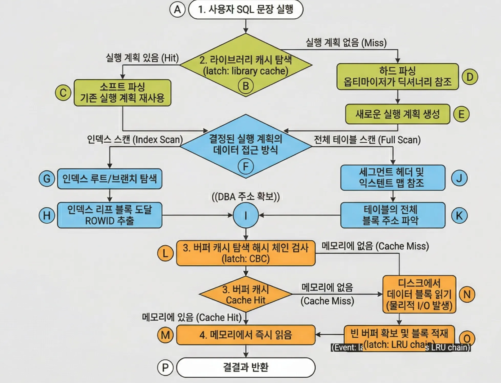

# 💡 개념 설명: 래치(Latch)란 무엇인가?

- 탐색 결과 기존에 만들어진 실행 계획이 없다면(**Hard Parse**), 이제 새로운 실행 계획을 저장할 **메모리 덩어리(Chunk)**가 필요합니다.
- 이때 Shared Pool의 빈 공간 리스트(Free Lists)를 뒤져서 적절한 크기의 메모리를 할당받아야 하는데, 이 **메모리 할당 과정**을 보호하는 것이 `latch: shared pool`입니다.

---

### 1. 래치의 정의

래치는 SGA(Shared Global Area)의 공유 메모리 구조를 보호하기 위한 **가벼운 동기화 장치(Light-weight Serialization Mechanism)**입니다. 여러 프로세스가 동시에 동일한 메모리 영역을 수정하거나 읽으려 할 때 데이터의 일관성을 보장하기 위해 사용됩니다.

### 2. 래치 vs 락(Lock/Enqueue)

| **구분** | **래치 (Latch)** | **락 (Lock/Enqueue)** |
| --- | --- | --- |
| **보호 대상** | SGA 메모리 구조 (SGA structures) | 데이터베이스 객체 (Table, Row 등) |
| **정교함** | 매우 빠르고 단순함 | 복잡하고 정교함 (공유 모드 등 존재) |
| **대기 메커니즘** | **Spinning** (CPU를 점유하며 반복 시도) | **Queuing** (대기 줄에서 대기) |
| **목적** | 메모리 손상 방지 | 트랜잭션 데이터 일관성 유지 |

### 3. 주요 래치의 종류 및 발생 원인

1. **latch: library cache**
    - **설명:** SQL 문장이나 실행 계획을 저장하는 라이브러리 캐시를 탐색하거나 갱신할 때 발생합니다.
    - **원인:** 과도한 **Hard Parsing**(바인드 변수를 사용하지 않는 SQL)이 주원인입니다.
2. **latch: shared pool**
    - **설명:** Shared Pool에서 새로운 메모리 청크를 할당받아야 할 때 발생합니다.
    - **원인:** 역시 Hard Parsing이 많아 새로운 SQL을 위한 메모리 공간을 계속 찾아야 할 때 심해집니다.
    
    → 언제 새로운 메모리 청크를 할당받는가?
    
    - 탐색 결과 기존에 만들어진 실행 계획이 없다면(**Hard Parse**), 이제 새로운 실행 계획을 저장할 **메모리 덩어리(Chunk)**가 필요합니다.
    - 이때 Shared Pool의 빈 공간 리스트(Free Lists)를 뒤져서 적절한 크기의 메모리를 할당받아야 하는데, 이 **메모리 할당 과정**을 보호하는 것이 `latch: shared pool`입니다.
3. **latch: cache buffers chains**
    - **설명:** 버퍼 캐시에서 특정 데이터 블록을 찾기 위해 체인을 탐색할 때 발생합니다.
    - **원인:** 특정 블록에 접근이 집중되는 **Hot Block** 현상이나, 인덱스 스캔 효율이 낮을 때 발생합니다.

<aside>
💡

내가 착각한것

Hot Block은 디스크에서 나타나는게 아니라 버퍼캐쉬안에서 나타나는 현상이다. 

</aside>

1. **latch: cache buffers LRU chain**
    - **설명:** 버퍼 캐시에서 빈 공간을 찾거나 더티 블록을 밀어내기 위해 LRU 리스트를 탐색할 때 발생합니다.
    - **원인:** 너무 많은 버퍼를 읽거나 쓰기 작업이 빈번하여 리스트 교체가 잦을 때 발생합니다.
2. **latch: redo allocation**
    - **설명:** Redo Log Buffer에 로그를 기록하기 위해 공간을 할당받을 때 발생합니다.
    - **원인:** 트랜잭션 양이 매우 많아 Redo 발생량이 극심할 때 나타납니다.

---

**latch: cache buffers chains vs latch: cache buffers LRU chain**

**🔄 데이터 접근 시나리오 (발생 순서)**
사용자가 특정 블록을 읽으려 할 때의 흐름을 따라가 봅시다.
1. **[탐색 단계]**
    ◦ 사용자가 블록을 찾기 위해 해당 해시 체인의 **CBC Latch**를 잡습니다.
    ◦ **Case 1 (Cache Hit):** 블록을 찾았습니다! 그럼 CBC 래치를 해제하고 데이터를 읽습니다. (이때는 LRU 래치를 거의 건드리지 않습니다.)
2. **[공간 확보 단계]**
    ◦ **Case 2 (Cache Miss):** 블록이 메모리에 없네요? 디스크에서 가져와야 합니다.
    ◦ 이때 **LRU Latch**를 잡고 "어떤 놈을 밀어내고(Aging out) 새 블록을 넣을까?" 고민하며 LRU 리스트를 뒤집니다.
    ◦ 빈 공간(Free Buffer)을 찾으면 그 자리에 디스크 데이터를 올리고, 다시 **CBC Latch**를 잡아서 "이제 이 블록은 이 체인에 연결됐어!"라고 지도를 업데이트합니다.
**📊 한눈에 비교하기구분latch: cache buffers chainslatch: cache buffers LRU chain주요 작업**블록 위치 탐색 (Select/Update 등 모든 작업)빈 버퍼 찾기, LRU 리스트 위치 변경**핵심 원인Hot Block** (특정 블록에 접근 집중)**Heavy Scanning** (대량의 데이터 로드)**비유**주소록(지도) 보기빈방(공간) 관리하기

## 💡 개념 설명: CBC vs LRU 래치와 SQL 패턴의 관계

### 1. `latch: cache buffers chains` (CBC) → 인덱스 및 Hot Block 의심

이 래치는 **"블록을 찾는 과정"**에서 발생합니다.

- **인덱스와의 관계:** 인덱스 리프 블록(Leaf Block)은 여러 행의 주소를 가지고 있습니다. 만약 특정 인덱스 블록 하나에 수많은 세션이 동시에 접근하여 데이터를 찾으려 하면, 해당 블록이 매달려 있는 **해시 체인**을 점유하기 위해 CBC 래치 경합이 발생합니다.
- **의심 시나리오:**
    - **Hot Block:** 소규모 테이블의 인덱스나 특정 범위에 데이터가 몰려 있는 인덱스 스캔 시 발생.
    - **비효율적인 SQL:** 인덱스 스캔 효율이 나빠서 너무 많은 블록을 읽어야 할 때(조회 범위가 너무 넓을 때).
    - **높은 동시성:** 여러 사용자가 동시에 같은 인덱스 루트/브랜치 블록을 경유할 때.

### 2. `latch: cache buffers LRU chain` (LRU) → 풀 스캔 및 교체 작업 의심

이 래치는 **"빈 공간을 확보하고 관리하는 과정"**에서 발생합니다.

- **풀 스캔(Full Scan)과의 관계:** 대량의 데이터를 읽는 Full Table Scan이 빈번하면, 버퍼 캐시에 새로운 데이터를 계속 올려야 합니다. 이때 기존에 있던 블록들을 밀어내고(Aging out) 빈 버퍼를 찾아야 하는데, 이 과정에서 LRU 리스트를 수정해야 하므로 LRU 래치를 잡게 됩니다.
- **의심 시나리오:**
    - **과도한 디스크 I/O:** 메모리에 없는 데이터를 디스크에서 계속 퍼 올릴 때.
    - **버퍼 캐시 부족:** DB 캐시 크기가 작아서 데이터가 조금만 들어와도 기존 블록을 계속 밀어내야 할 때.
    - **다량의 DML:** `INSERT`나 `UPDATE`가 쏟아져서 더티 블록(Dirty Block)이 많아지고, 이를 비우기 위해 리스트를 뒤질 때.

## 💡 개념 설명: Full Table Scan과 Buffer Cache 관리

오라클은 대량의 데이터를 읽는 Full Table Scan(FTS)이 버퍼 캐시 전체를 오염(Pollution)시키는 것을 방지하기 위해 특별한 알고리즘을 사용합니다. 사용자님이 기억하시는 내용은 아마 다음 두 가지 중 하나일 것입니다.

### 1. "LRU 리스트의 끝(Cold End)에만 머문다" (일반적인 FTS)

일반적으로 FTS를 통해 읽혀진 블록들도 버퍼 캐시에 올라가긴 합니다. 하지만 인덱스 스캔과 달리 **LRU 리스트의 가장 끝부분(Least Recently Used end, 즉 곧 버려질 위치)**에 배치됩니다.

- **이유:** 대용량 테이블을 한 번 읽었다고 해서 그 블록들을 MRU(가장 최근 사용) 쪽에 두면, 기존에 자주 사용하던 소중한 데이터들이 메모리에서 다 밀려나 버리기 때문입니다.
- **결과:** 메모리에 잠시 머물다가 금방 밀려납니다. 그래서 "올라가지 않는다"라고 느껴질 수 있습니다.

### 2. "버퍼 캐시를 아예 통과하지 않는다" (Direct Path Read) 👈 **핵심!**

사용자님이 기억하시는 "진짜 안 올라가는 경우"는 바로 **Direct Path Read**입니다.

- **메커니즘:** 테이블이 매우 크거나 시스템 부하 상황에 따라, 오라클은 데이터를 버퍼 캐시(SGA)에 올리지 않고 디스크에서 **프로세스의 개인 메모리 영역(PGA)으로 직접** 읽어 들입니다.
- **버전 정보:** Oracle 11g 이후부터는 `_small_table_threshold`라는 파라미터보다 큰 테이블을 FTS 할 때 이 방식이 기본적으로 자주 사용됩니다.
- **결과:** 이 경우 데이터는 **진짜로 LRU 리스트에 아예 등록되지 않습니다**

## 개념 설명: 해시 체인 (Hash Chain)

### 1. 정의

해시 체인이란 오라클이 **버퍼 캐시(Buffer Cache)에서 특정 데이터 블록을 매우 빠르게 찾기 위해 사용하는 자료 구조**입니다. 수많은 데이터 블록 중에서 내가 원하는 블록이 메모리 어디에 있는지 일일이 전수 조사(Full Scan)하는 것은 비효율적이기 때문에, '해시 알고리즘'을 이용한 지도를 만드는 것입니다.

### 2. 작동 원리 (메커니즘)

사용자가 특정 블록을 요청하면 오라클은 다음과 같은 과정을 거칩니다.

1. **해시 함수 적용:** 블록의 주소 정보(DBA: Data Block Address)를 해시 함수에 넣습니다.
2. **해시 버킷(Hash Bucket) 결정:** 함수 결과값에 따라 특정 '바구니(Bucket)'가 지정됩니다.
3. **체인 탐색:** 하나의 버킷에는 여러 개의 **버퍼 헤더(Buffer Header)**가 연결 리스트(Linked List) 형태로 매달려 있습니다. 이 연결된 줄기가 바로 **해시 체인**입니다.
4. **블록 확인:** 체인을 따라가며 내가 찾는 블록의 헤더가 있는지 확인하고, 있다면 해당 메모리 주소로 가서 데이터를 읽습니다.

### 3. 왜 '체인'인가? (Collision)

서로 다른 블록 주소를 해시 함수에 넣어도 가끔 같은 결과(버킷 번호)가 나올 수 있습니다. 이를 '해시 충돌'이라고 하는데, 오라클은 같은 버킷에 해당하는 블록들을 줄줄이 사탕처럼 엮어서 관리하기 때문에 **체인**이라는 이름이 붙었습니다.

### 4. 래치(Latch)와의 관계

우리가 앞에서 배운 **`latch: cache buffers chains`**가 바로 이 체인을 훑어볼 때 사용하는 "열쇠"입니다. 체인을 뒤지는 동안 누군가 내용을 바꾸면 안 되기 때문에 래치를 잡고 탐색하는 것이죠.

---

## 💡 개념 설명: DBA(Data Block Address)의 원천

DBA는 특정 블록이 디스크 상의 어떤 파일(**File ID**)에서 몇 번째 블록(**Block ID**)인지를 나타내는 고유 주소입니다. 오라클이 이 주소를 알아내는 방법은 **'어떤 방식으로 데이터에 접근하느냐'**에 따라 달라집니다.

### 1. 인덱스를 통한 접근 (Index Scan)

사용자님이 말씀하신 대로 **인덱스의 리프 블록**은 아주 중요한 원천입니다.

- **과정:** 인덱스 탐색(Root → Branch → Leaf)을 마치면, 리프 블록에는 해당 키 값과 함께 **ROWID**라는 정보가 저장되어 있습니다.
- **구조:** ROWID 안에는 해당 행(Row)이 저장된 **데이터 블록의 DBA**가 포함되어 있습니다.
- **결과:** 오라클은 리프 블록에서 얻은 이 DBA를 해시 함수에 넣어 "이 데이터 블록이 지금 버퍼 캐시에 있나?"를 확인하게 됩니다.

### 2. 전체 테이블 스캔 (Full Table Scan)

인덱스를 타지 않을 때는 리프 블록을 보지 않습니다. 이때는 어디서 주소를 가져올까요?

- **원천:** 해당 테이블의 **세그먼트 헤더(Segment Header)**와 **익스텐트 맵(Extent Map)**에서 가져옵니다.
- **과정:** 오라클은 데이터 딕셔너리(또는 세그먼트 헤더)를 확인하여 이 테이블에 할당된 모든 **익스텐트(Extent)**의 정보를 파악합니다. 익스텐트는 연속된 블록의 묶음이므로, 시작 DBA와 블록 개수만 알면 그 안에 속한 모든 블록의 DBA를 계산해낼 수 있습니다.

### 3. 인덱스 블록 자체를 찾을 때

"그럼 인덱스 리프 블록 자체의 DBA는 어디서 찾지?"라는 의문이 생길 수 있습니다.

- **상위 블록:** 브랜치(Branch) 블록이 하위 리프 블록들의 DBA를 가지고 있습니다.
- **최상위(Root):** 인덱스의 뿌리인 루트 블록의 DBA는 데이터 딕셔너리(예: `USER_INDEXES`)에 저장되어 있습니다.

---

## 🛠️ 요약: 접근 방식별 DBA 출처

| **접근 방식** | **DBA 정보를 얻는 곳** |
| --- | --- |
| **Index Lookup** | 인덱스 리프 블록 내의 **ROWID** |
| **Full Table Scan** | 세그먼트 헤더 및 **익스텐트 맵(Extent Map)** |
| **Index Traversal** | 상위 노드(Root/Branch)가 가진 하위 포인터 |

---

## 💡 개념 설명: SQL 실행부터 데이터 인출까지의 전체 흐름

사용자님이 정리하신 흐름을 오라클의 내부 메커니즘에 맞춰 조금 더 정교하게 다듬어 보았습니다.

### 1. [Parse 단계] 라이브러리 캐시 검색

- **Soft Parse:** 라이브러리 캐시에서 동일한 SQL과 실행 계획을 찾으면 바로 실행 단계로 넘어갑니다.
- **Hard Parse:** 없다면 옵티마이저가 **데이터 딕셔너리(통계 정보)**를 참조하여 **실행 계획**을 새로 만듭니다.

### 2. [Execute 단계] DBA(주소) 확보

- **인덱스 스캔 시:** 실행 계획에 따라 인덱스 루트 → 브랜치를 거쳐 **리프 블록**에 도달합니다. 여기서 우리가 원하는 데이터가 있는 곳의 주소인 **ROWID(DBA 포함)**를 얻습니다.
- **풀 스캔 시:** **세그먼트 헤더**의 익스텐트 맵을 읽어 테이블에 속한 모든 블록의 주소(DBA) 리스트를 생성합니다.

### 3. [Fetch/Access 단계] 버퍼 캐시 탐색 (해시 체인 활용)

- 확보한 DBA를 **해시 함수**에 넣어 특정 **해시 버킷**을 찾습니다.
- 해당 버킷의 **해시 체인**을 따라가며 메모리에 블록이 있는지 확인합니다. (이때 `latch: cache buffers chains`를 잡습니다.)

### 4. [I/O 단계] 데이터 읽기

- **Cache Hit:** 메모리에서 바로 읽습니다.
- **Cache Miss:** 디스크에서 블록을 퍼 올려 버퍼 캐시에 적재합니다. (이때 빈 공간을 찾기 위해 `latch: cache buffers LRU chain`을 사용합니다.)
- **Direct Path Read:** (대량 풀 스캔 등 특정 상황) 버퍼 캐시를 거치지 않고 디스크에서 바로 PGA로 읽어 들입니다.

